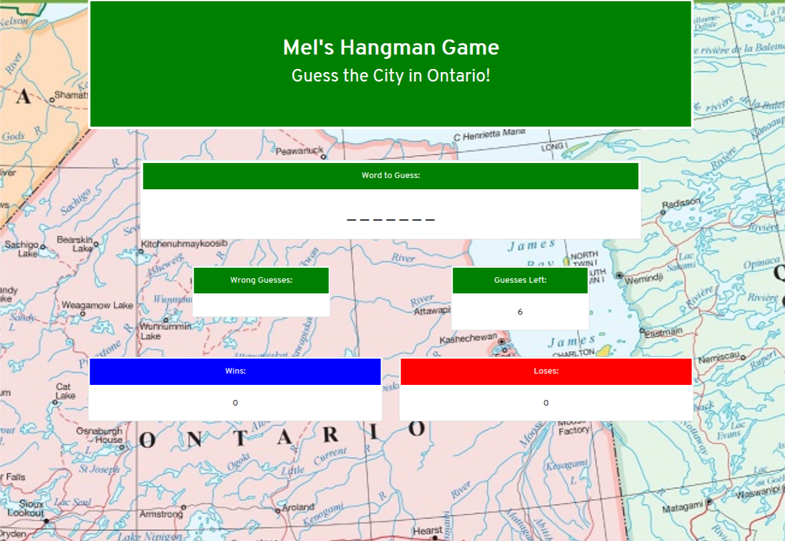
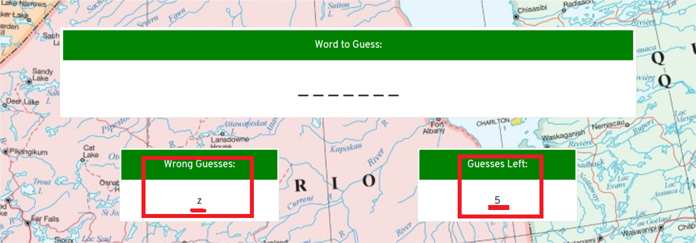
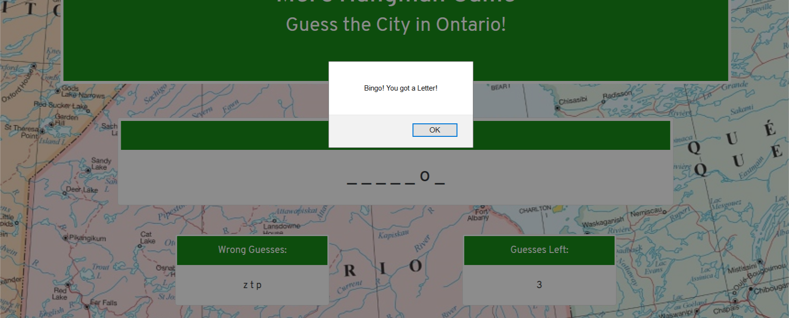
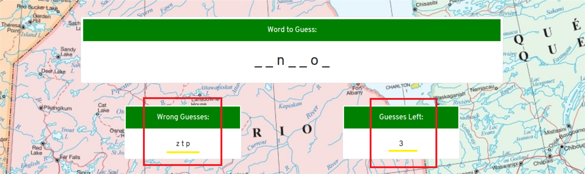
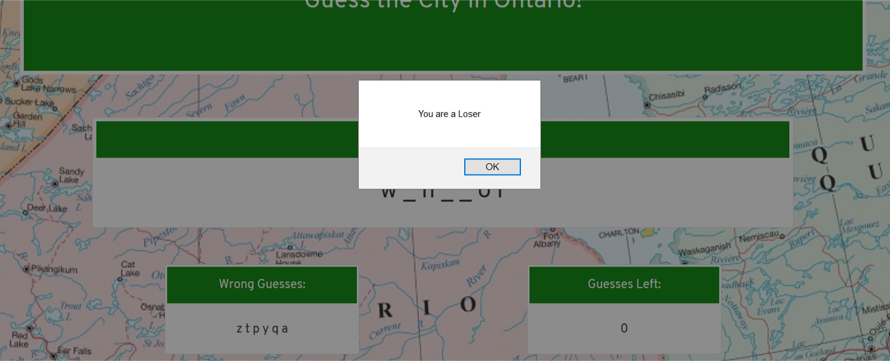
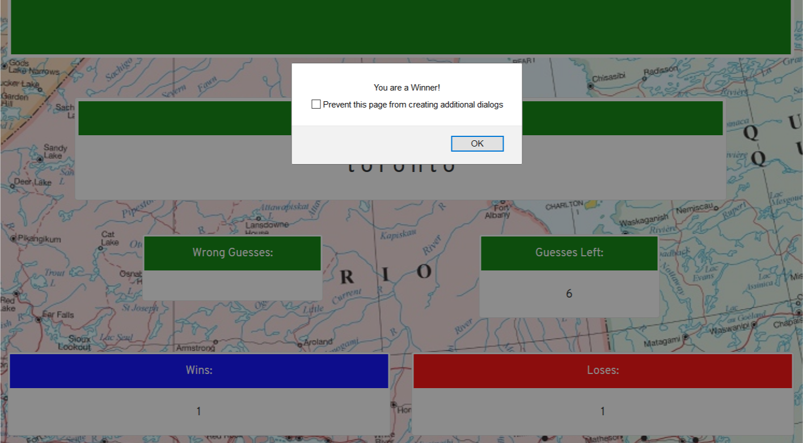

# Word-Guess-Game

## Check out the live app:
https://melvynling.github.io/Word-Guess-Game

## Objective
This game is the classic hangman. The user guess letters from the alphabet in order to correctly guess the word. The theme of the game is Cities in the province of Ontario Canada

## Overview
this app utilizes javascript for the logic of this game and bootstrap for the front end. the game allows for the user to guess the word until the get it wrong or run out of guesses to make. 
it uses a series of JavaScript if/else conditionals to set the logic in motion for this app. It also makes use of methods and events to track the users guesses and record their scores. Specifically, the onkeyup event is used, as well as methods such as getElementById, push, toString, fromCharCode, etc

## Instructions/Walkthrough

* when the page loads, the user is presented with a word to guess, a section that highlights their wrong guesses, their right guesses, as well as home many times they've won and lost.

* when the user guesses wrong, the letter is put in the wrong guesses section, and the number of guesses decreases.

* when the user guesses right, they are alerted of a correct guess and the letter shows up in the word to guess box. when you guess the letter correct, the number of guesses left do not decrease.

* If the user makes too many incorrect guesses, they are alerted that they have lost the game, and the loss is recored in their loses column.

* if the user guesses the word correctly, then they are prompted of a win and a win in recorded in the appropriate column.
